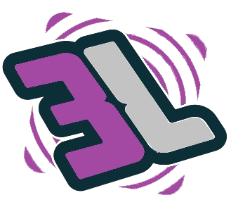

<h1 align="center">
  <a href="
    
  </a>
</h1>

  <h3>Bloxluck Predictor</h3>
   Do you want to win?
   
   

  

 

## 📖 About

BloxLuck Predictor allows you to grow your inventory in Adopt Me! and Murder Mystery 2. It allows you to win with a **89% accuracy** by calculating the seeds Bloxluck uses. 🏆

## 🔧 Installation

1. **Download** the Bloxluck Predictor:

2. **Extract** the files from the ZIP archive.

3. **Open Google Chrome** and navigate to `chrome://extensions/`.

4. **Enable "Developer mode"** in the top-right corner.

5. Click **"Load unpacked"** and select the folder where you extracted the files.

## 🕹️ How to Use?

1. **Go to the Website**:
   - For *Adopt Me!*, visit <a href="https://amp.bloxluck.com/" target="_blank">Adopt Me</a>
   - For *Murder Mystery 2*, visit <a href="https://bloxluck.com/" target="_blank">Murder Mystery 2</a>

2. **Open the Extensions Menu**:
   - In the top-right corner of your browser, click the **puzzle icon** to open the Extensions menu.

3. **Select "Bloxluck Predictor"** from the list of extensions.

4. **Enter the Key**:
   - When the Bloxluck Predictor panel appears, enter the key
     - (vLaIZPlBzsHvkZdyDsImkUhJO key 🔑
     - Make sure to enter it **exactly** as shown!
# How It Works

The Bloxluck Predictor works by calculating the seeds from the data provided by the Bloxluck websites. It analyzes these seeds to predict the upcoming color in the game. Using complex algorithms, the tool processes the data from games like Adopt Me and Murder Mystery 2 to accurately forecast which color is most likely to appear next. By doing so, it gives you a significant advantage in predicting the game's outcome.

|  #  |    Name    | Languages |
| :-: | :--------: | :-------: |
| 1.  | Background |  Js, Cpp  |
| 2.  |  Website   |  Js, Ejs  |
| 3.  |    API     |    Js     |

## Background

The Bloxluck Predictor was developed to provide a tool that helps players gain an advantage in popular Roblox games, specifically Adopt Me and Murder Mystery 2. These games often involve random events, such as color selections, which can significantly impact the outcome of the game. By analyzing data from the Bloxluck websites, the tool calculates the patterns and "seeds" behind these random events to predict which color will be selected next.

## 📝 License

Distributed under the MIT License. See [LICENSE](/LICENSE) for more information.
